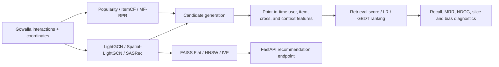

# Spatial Graph Recommendation

An end-to-end location-aware recommendation system on Gowalla, covering retrieval baselines, graph models, candidate generation, point-in-time features, GBDT ranking, diagnostics, ANN benchmarking, and a minimal serving API.

## Highlights

- Complete retrieval-to-serving path: Popularity → ItemCF → MF-BPR → LightGCN → Spatial-LightGCN → candidates → point-in-time features → GBDT ranker → diagnostics → FAISS/FastAPI.
- Reproducible benchmark data: 29,858 users, 40,981 POIs, 810,128 official-train interactions, and 217,242 official-test interactions.
- Spatial-LightGCN reached Recall@20 0.18335 and NDCG@20 0.15638, versus 0.17724 and 0.15123 for the reproduced LightGCN baseline.
- The frozen Spatial-LightGCN candidate generator reached 93.5% Recall@200; GBDT ranking improved Recall@20 from 0.411 to 0.577 and NDCG@20 from 0.167 to 0.321 on the same candidate pool.
- Business-proxy and subgroup diagnostics quantify coverage, popularity bias, tail exposure, activity slices, and recommendation distance.
- FAISS Flat, HNSW, and IVF are benchmarked for recall, latency, build time, and disk size; at 40,981 items, exact search remains a strong default.

> Results are tied to committed configurations and artifacts under `experiments/results/`. Limitations of the evaluation protocol are stated explicitly below.

## System Architecture



## Results

### Retrieval

| Model | Recall@20 | NDCG@20 | Evidence |
|---|---:|---:|---|
| Popularity | 0.04163 | 0.03169 | `experiments/results/summary.csv` |
| ItemCF | 0.11787 | 0.08610 | `experiments/results/summary.csv` |
| MF-BPR | 0.12950 | 0.10760 | `experiments/results/summary.csv` |
| LightGCN | 0.17724 | 0.15123 | `experiments/results/summary.csv` |
| Spatial-LightGCN | **0.18335** | **0.15638** | `experiments/results/summary.csv` |
| SASRec | 0.12577 | 0.09961 | `experiments/results/summary.csv` |

The committed Spatial-LightGCN configuration uses 10 geographic neighbors, `lambda_spatial=0.3`, a 100 km maximum edge distance, and an adaptive 0.21 km bandwidth. Its Recall@20 gain over the reproduced LightGCN run is 3.45% relative.

### Candidate generation and ranking

The frozen Spatial-LightGCN candidate pool reaches Recall@50/100/200 of 0.655/0.825/0.935. Ranking uses leave-last-out targets inside official train, layered negatives, and point-in-time features.

| Method | Recall@20 | MRR@20 | NDCG@20 |
|---|---:|---:|---:|
| Retrieval-score sort | 0.41103 | 0.10025 | 0.16714 |
| Logistic regression | 0.50368 | 0.20470 | 0.27073 |
| GBDT | **0.57714** | **0.24867** | **0.32102** |

The GBDT ablation progresses from retrieval score only (Recall@20 0.405), to user/item statistics (0.542), spatial features (0.560), and the full 24-feature model (0.577). Evidence is in `experiments/results/ranking_eval.csv` and [`docs/03_two_stage_ranking.md`](docs/03_two_stage_ranking.md).

### Diagnostics

Compared with retrieval-score sorting, the GBDT ranker improved catalog coverage from 0.327 to 0.553, tail exposure from 0.049 to 0.203, and reduced popularity lift from 8.52× to 5.87×. The official split contains no strict cold-start users or items; that absence is reported rather than relabeled. See [`docs/04_business_slices.md`](docs/04_business_slices.md).

### ANN and serving

| Index | Recall@200 vs exact | P50 latency | P95 latency | Build time | Disk |
|---|---:|---:|---:|---:|---:|
| Flat | 1.000 | 1.60 ms | 2.64 ms | 0.01 s | 10.5 MB |
| HNSW | 0.875 at `efSearch=1024` | 0.77 ms | 1.15 ms | 2.25 s | 21.6 MB |
| IVF | 0.999 at `nprobe=64` | 0.59 ms | 0.96 ms | 0.13 s | 10.8 MB |

Latency values are the committed mid-sweep operating points (`efSearch=256`, `nprobe=8`), while the displayed recall values are the maximum tested settings. The repository keeps both curves so they are not presented as one operating point. See [`docs/05_ann_serving.md`](docs/05_ann_serving.md).

## Quick Start

Python 3.11 is recommended. CPU is sufficient for preprocessing, tests, ranking, diagnostics, and the small serving benchmark; graph-model training is substantially faster on a GPU.

```bash
git clone https://github.com/xi2618zh-s/spatial-graph-recommendation.git
cd spatial-graph-recommendation
python -m pip install -r requirements.txt
python -m pytest -q
```

A clean clone runs the self-contained tests and skips checks that require generated data or trained checkpoints.

To rebuild the full data path, download the SNAP Gowalla check-ins described under [Data](#data), then run:

```bash
python scripts/prepare_data.py
python scripts/train.py --config configs/mf_gowalla.yaml
```

## Repository Structure

```text
configs/                versioned experiment and serving configurations
data/gowalla/           committed official LightGCN split and ID mappings
data/raw/               external SNAP download; ignored
data/processed/         generated coordinates, sequences, and ranking rows; ignored
src/data/               datasets, graph construction, temporal splits, sampling
src/models/             MF, LightGCN, Spatial-LightGCN, and SASRec
src/features/           point-in-time user, item, cross, and context features
src/train/              retrieval and ranking trainers
src/eval/               ranking, bootstrap, bias, and slice evaluation
src/serving/            FAISS search and FastAPI application
scripts/                thin reproducible entrypoints
experiments/results/    committed metric tables and diagnostics
tests/                  leakage, reproducibility, resume, ANN, and smoke tests
docs/                   method and result notes
```

## Methodology

Retrieval models are evaluated with full ranking after masking training interactions. Spatial-LightGCN augments the user-item graph with weighted POI-POI edges built from geographic proximity. Candidate generation freezes a retrieval model before producing top-K pools.

The ranking dataset uses a leave-last-out target within each user's official-train sequence. Features are computed against the user's prefix at prediction time, and leakage tests cover held-out targets, prefix-only user statistics, deterministic sample generation, and the experimental V2 temporal split.

The `ranking-v2` work adds a stricter four-layer temporal protocol (`H_inner | v0 | y_train | y_val`), exact point-in-time item popularity, and a multi-source recall preview. It is kept separate from the headline results until the complete V2 ranking evaluation is finished.

## Evaluation

```bash
# Candidate generation and ranking
python scripts/build_ranking_data.py --config configs/ranking_data.yaml
python scripts/evaluate_pipeline.py --config configs/ranking_data.yaml

# Business-proxy and subgroup diagnostics
python scripts/evaluate_slices.py --config configs/ranking_data.yaml

# ANN benchmark and serving demo
python scripts/build_ann_index.py --config configs/ann_index.yaml
python scripts/benchmark_serving.py --config configs/ann_index.yaml
uvicorn src.serving.app:app --reload
```

The API exposes `GET /health` and `GET /recommend?user_id=0&k=10` after the configured index and model artifacts have been built.

## Reproducibility

- Every published metric maps to a committed CSV/JSON result and a versioned YAML configuration.
- Random-number state is saved and restored for exact interrupted-training tests.
- Result rows are idempotent by run name, preventing duplicate resume entries.
- Raw data, processed tables, logs, checkpoints, and FAISS indexes remain local and ignored.
- GitHub Actions runs the clean-clone CPU test suite; data- and checkpoint-dependent tests skip with explicit reasons.

## Data

| File | Source | Role |
|---|---|---|
| `data/gowalla/{train,test,user_list,item_list}.txt` | [LightGCN repository](https://github.com/kuandeng/LightGCN) | Official split; committed for reproducibility |
| `data/raw/loc-gowalla_totalCheckins.txt.gz` | [SNAP Gowalla](https://snap.stanford.edu/data/loc-gowalla.html) | Coordinates and timestamps; not committed |

Expected SHA-256 for the SNAP archive used by this project: `c1c3e19effba649b6c89aeab3c1f9459fad88cfdc2b460fc70fd54e295d83ea0`.

## Limitations

- The retrieval runs follow the original LightGCN-style protocol in which official-test metrics informed early stopping; those numbers support reproduction and sensitivity analysis, not an untouched final-test claim.
- The ranking stage repairs this for its own task with point-in-time targets inside official train, but its headline results still depend on one frozen retrieval checkpoint and one data split.
- Multi-seed training is not yet committed, so the Spatial-LightGCN improvement is not claimed as stable across random initialization.
- The official split has no strict cold-start users or items, so cold-start quality is not evaluated.
- ANN timings are machine- and scale-specific. At roughly 41K items, exact search is already fast enough to remain competitive.
- The FastAPI service is a minimal local demonstration, not a production deployment.

## License

No open-source license has been selected. The repository is currently available for viewing and evaluation only; normal copyright rules apply.
